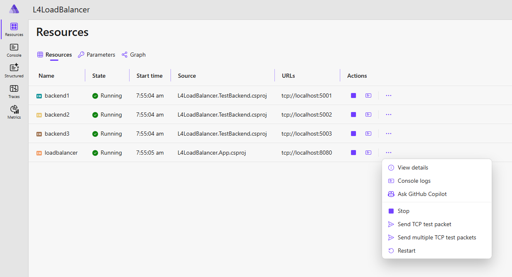

# L4LoadBalancer

A software-based Layer 4 (TCP) load balancer for distributing traffic across multiple backend services.

## Features

- **Multi-client support**: accepts concurrent TCP connections from multiple clients.
- **Multiple strategies**: round robin and least connections load balancing.
- **Health monitoring**: automatic detection and removal of unhealthy backends.
- **TCP-based**: pure Layer 4 proxying without application-layer concerns.
- **Configurable**: flexible settings via `appsettings.json` and environment variables.

## Architecture

- Logical separation of concerns following Clean Architecture within _L4LoadBalancer.App_ project.
This separation of concerns could be refactored to multiple projects as the solution grows.

## Getting started

### Prerequisites
- .NET 10

### Demo with Aspire

> NB. Aspire has been used _only_ to simplify running the demo by providing a convenient dashboard
to start and stop backend services, display logging output, and send test TCP packets. Default Aspire
proxying has been disabled to allow L4LoadBalancer to handle TCP connections directly.

Start the full orchestrated demo environment with 3 test backends:

```
dotnet run --project L4LoadBalancer.AppHost/
```

Alternatively, if you have Aspire CLI installed, it can be used to start the demo environment:

```
aspire run
```

Then, login to the Aspire dashboard at https://l4loadbalancer.dev.localhost:17263/login?t=83ca573c7817570d5febd682fa90e348.


- Load balancer listens on port 8080.
- Test backends run on ports 5001, 5002, 5003.
- Use Aspire custom resource commands on `loadbalancer` to send TCP test packets:
  - **Send TCP test packet**: sends single test packet.
  - **Send multiple TCP test packets**: sends multiple packets to demonstrate load balancing.



## Configuration

### LoadBalancing strategy

In `src/L4LoadBalancer.App/appsettings.json`:

```
{ "LoadBalancer": { "Strategy": "RoundRobin"  // or "LeastConnections" } }
```

- `RoundRobin`: cycles through healthy servers sequentially. Best for uniform workloads.
- `LeastConnections`: routes to the server with fewest active connections. Better for long-lived connections.


### Health monitoring

```
{ "HealthMonitor": { "CheckInterval": "00:00:05", "Timeout": "00:00:02" } }
```

## Testing

### Unit tests

```
dotnet test tests/L4LoadBalancer.App.UnitTests/
```

### Integration tests

```
dotnet test tests/L4LoadBalancer.App.IntegrationTests/
```

